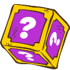
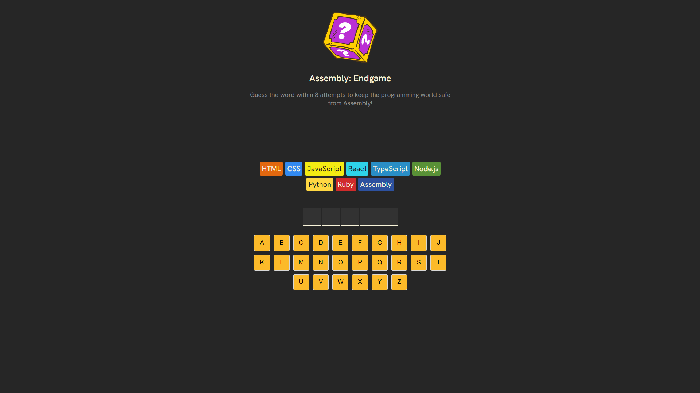
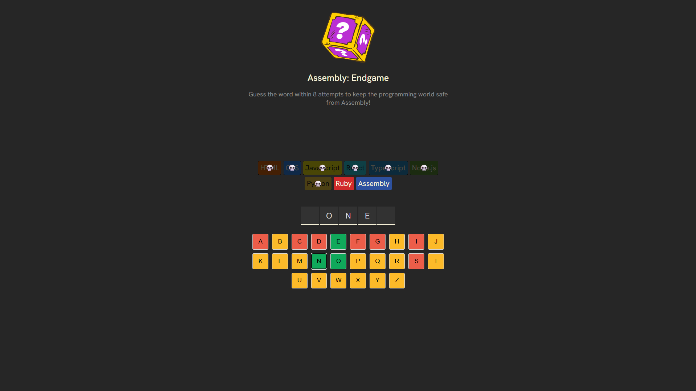
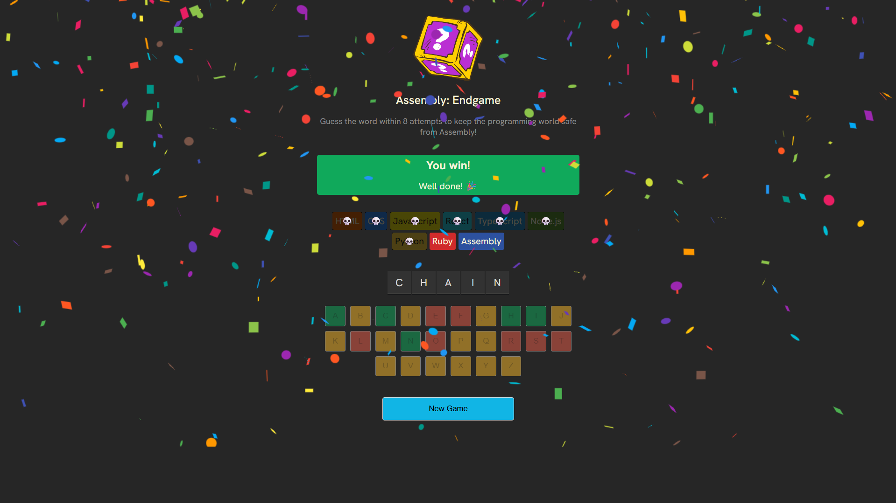
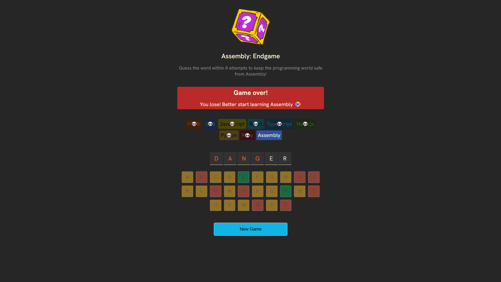

<div align="center">



# 🎮 Assembly: Endgame

**Guess the Word, Save the Programming World**

A modern word-guessing game with a programming twist! Test your vocabulary skills while trying to prevent Assembly language from taking over the programming world. Built with React and featuring beautiful animations, accessibility features, and a unique programming language theme.


## 🌐 **LIVE PREVIEW**

[](https://hazemandassemblyendgame.netlify.app/)

**👉 [https://hazemandassemblyendgame.netlify.app/](https://hazemandassemblyendgame.netlify.app/) 👈**

*Experience the full game with confetti animations, accessibility features, and smooth gameplay*

</div>

---

## 📋 Table of Contents

- [🤖 Introduction](#-introduction)
- [⚙️ Tech Stack](#️-tech-stack)
- [🔋 Features](#-features)
- [🤸 Quick Start](#-quick-start)
- [🕸️ Project Structure](#️-project-structure)
- [🎯 Game Rules](#-game-rules)
- [🚀 Deployment](#-deployment)
- [📱 Screenshots](#-screenshots)
- [🤝 Contributing](#-contributing)

---

## 🤖 Introduction

Assembly: Endgame is an engaging word-guessing game that combines classic hangman mechanics with a unique programming theme. Players must guess letters to reveal a hidden word while trying to prevent Assembly language from "eliminating" other programming languages.

The game features:
- **Interactive Gameplay** with visual feedback for correct and incorrect guesses
- **Programming Language Theme** with 9 different languages as "lives"
- **Accessibility Features** including screen reader support and keyboard navigation
- **Beautiful Animations** including confetti effects for victories
- **Responsive Design** that works perfectly on all devices

Built with modern React patterns and best practices, this game provides an entertaining way to test vocabulary skills while celebrating the programming community.

---

## ⚙️ Tech Stack

### Frontend
- **React 19** - Modern UI library with hooks and functional components
- **Vite** - Lightning-fast build tool and development server
- **JavaScript ES6+** - Modern JavaScript features and syntax
- **CSS3** - Custom styling with modern CSS features
- **React Confetti** - Celebration animations for game victories

### Development Tools
- **ESLint** - Code linting and quality assurance
- **PostCSS** - CSS processing and optimization
- **clsx** - Utility for constructing className strings conditionally

### Key Libraries
- **React Confetti** - Beautiful confetti animations for winning moments
- **clsx** - Conditional className utility for dynamic styling

---

## 🔋 Features

### 🎯 Core Gameplay
- **👉 Word Guessing**: Classic hangman-style letter guessing mechanics
- **👉 Programming Theme**: 9 programming languages as "lives" (HTML, CSS, JavaScript, React, TypeScript, Node.js, Python, Ruby, Assembly)
- **👉 Visual Feedback**: Color-coded keyboard buttons for correct/incorrect guesses
- **👉 Language Elimination**: Each wrong guess "eliminates" a programming language with skull emoji
- **👉 Random Word Selection**: 483+ words from a curated vocabulary list

### 🎨 User Experience
- **👉 Responsive Design**: Mobile-first approach with clean, modern styling
- **👉 Dark Theme**: Beautiful dark color scheme with high contrast
- **👉 Smooth Animations**: Confetti effects and smooth transitions
- **👉 Interactive Elements**: Hover effects and visual feedback
- **👉 Game Status Display**: Clear win/lose messages with contextual styling

### ♿ Accessibility Features
- **👉 Screen Reader Support**: ARIA labels and live regions for status updates
- **👉 Keyboard Navigation**: Full keyboard accessibility for all interactive elements
- **👉 High Contrast**: Color combinations that meet accessibility standards
- **👉 Semantic HTML**: Proper heading structure and semantic elements
- **👉 Focus Management**: Clear focus indicators and logical tab order

### 🔧 Technical Features
- **👉 React Hooks**: Modern state management with useState
- **👉 Component Architecture**: Clean, reusable component structure
- **👉 Performance Optimized**: Efficient rendering and minimal re-renders
- **👉 Error Handling**: Graceful handling of edge cases
- **👉 Type Safety**: PropTypes and careful data validation

---

## 🤸 Quick Start

### 🌐 **Try It Live First!**

**Before setting up locally, check out the live game:**
👉 **[https://hazemandassemblyendgame.netlify.app/](https://hazemandassemblyendgame.netlify.app/)** 👈

*Experience the full gameplay with all animations, accessibility features, and smooth interactions!*

### Prerequisites

Make sure you have the following installed on your machine:

- **Git** - Version control system
- **Node.js** (v18 or higher) - JavaScript runtime
- **npm** (v9 or higher) - Package manager

### Installation

1. **Clone the repository**
   ```bash
   git clone https://github.com/therealhazem/Assembly-EndGame.git
   cd Assembly-EndGame
   ```

2. **Install dependencies**
   ```bash
   npm install
   ```

3. **Run the development server**
   ```bash
   npm run dev
   ```

4. **Open your browser**
   Navigate to [http://localhost:5173](http://localhost:5173)

5. **Start playing!**
   Click on letters to guess the hidden word and save the programming world!

---

## 🕸️ Project Structure

```
assembly-game/
├── public/                      # Static assets
│   └── Assembly.svg            # Game logo and branding
├── src/                        # Source code
│   ├── components/             # React components
│   │   ├── header.jsx         # Main game component
│   │   ├── languages.js       # Programming languages data
│   │   ├── utils.js           # Utility functions
│   │   └── words.js           # Word list for the game
│   ├── App.jsx                # Main application component
│   ├── main.jsx               # Application entry point
│   └── index.css              # Global styles and game styling
├── index.html                  # HTML template
├── package.json                # Dependencies and scripts
├── vite.config.js             # Vite configuration
└── eslint.config.js           # ESLint configuration
```

---

## 🎯 Game Rules

### How to Play
1. **Objective**: Guess the hidden word by selecting letters
2. **Lives**: You have 8 attempts (represented by programming languages)
3. **Winning**: Reveal all letters in the word before running out of lives
4. **Losing**: If you make 8 incorrect guesses, Assembly wins!

### Programming Languages (Your Lives)
- **HTML** - The foundation of web development
- **CSS** - Styling and visual design
- **JavaScript** - Dynamic web functionality
- **React** - Modern UI library
- **TypeScript** - Type-safe JavaScript
- **Node.js** - Server-side JavaScript
- **Python** - Versatile programming language
- **Ruby** - Elegant and productive language
- **Assembly** - The final boss! (Don't let it win!)

### Game Features
- **Visual Feedback**: Correct letters turn green, incorrect ones turn red
- **Language Elimination**: Each wrong guess eliminates a programming language with a skull 💀
- **Celebration**: Confetti animation when you win!
- **New Game**: Start fresh with a new random word after each game

---

## 🚀 Deployment

### Vercel (Recommended)

1. **Connect your repository** to Vercel
2. **Deploy** with automatic builds on every push
3. **Enjoy** your live game!

### Other Platforms

The application can be deployed to any platform that supports static sites:
- **Netlify**
- **GitHub Pages**
- **Firebase Hosting**
- **AWS S3 + CloudFront**

### Build for Production

```bash
npm run build
```

The built files will be in the `dist` directory, ready for deployment.

---

## 📱 Screenshots

<div align="center">

### Game Start


### In Progress


### Victory with Confetti


### Game Over


</div>

---

## 🤝 Contributing

We welcome contributions! Please follow these steps:

1. **Fork the repository**
2. **Create a feature branch** (`git checkout -b feature/amazing-feature`)
3. **Commit your changes** (`git commit -m 'Add amazing feature'`)
4. **Push to the branch** (`git push origin feature/amazing-feature`)
5. **Open a Pull Request**

### Development Guidelines

- Follow the existing code style and conventions
- Write meaningful commit messages
- Test your changes thoroughly
- Ensure accessibility features remain intact
- Update documentation as needed

### Ideas for Contributions

- **New Word Lists**: Add themed word collections (tech terms, programming concepts)
- **Difficulty Levels**: Implement easy/medium/hard word categories
- **Sound Effects**: Add audio feedback for game actions
- **High Scores**: Implement local storage for best games
- **Multiplayer**: Add real-time multiplayer functionality
- **Themes**: Create different visual themes (light mode, color variations)

---

<div align="center">

**Made with ❤️ by Hazem Elgindy** 

*Fueled by Egyptian Songs & a Lot of Coffee*

**🌐 Check my [Portfolio](https://hazemelgindy.me)**

[⭐ Star this repo](https://github.com/therealhazem/Assembly-EndGame) • [🐛 Report Bug](https://github.com/therealhazem/Assembly-EndGame/issues) • [💡 Request Feature](https://github.com/therealhazem/Assembly-EndGame/issues)

</div>
